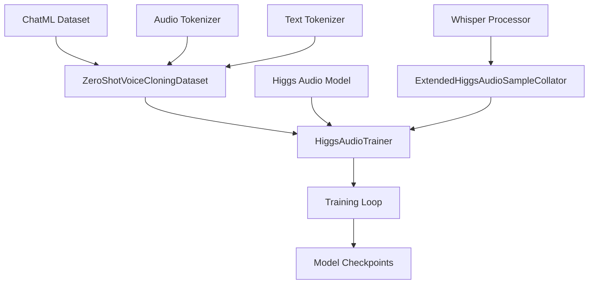
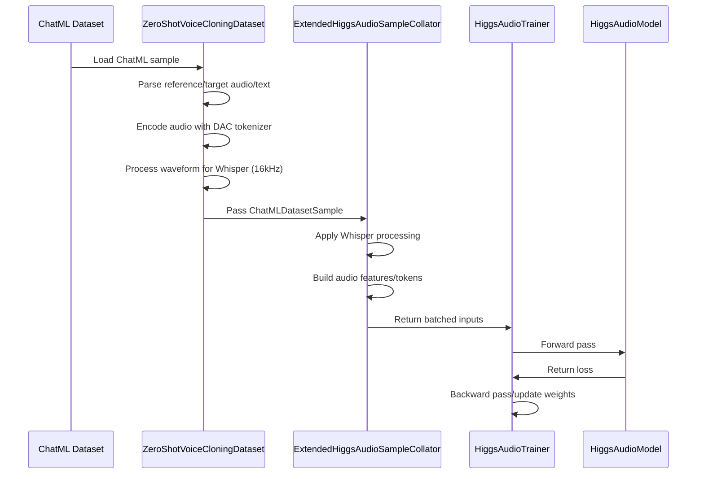

# Higgs Audio v2 Training Pipeline Compatibility for Zero-Shot Voice Cloning

## Overview

This document outlines the design and implementation of a new training pipeline for Higgs Audio v2 that is specifically compatible with zero-shot voice cloning datasets in ChatML format. The implementation follows the same data processing pipeline as the inference script to ensure consistency between training and inference.

## Architecture



## Key Components

### 1. ZeroShotVoiceCloningDataset

A custom dataset class that processes ChatML format data for zero-shot voice cloning training:

- **Input Format**: ChatML JSON files with reference audio, reference text, and target text
- **Audio Processing**: 
  - Loads reference audio for Whisper conditioning (16kHz)
  - Encodes audio with DAC tokenizer for audio tokens
  - Handles both input and label audio processing
- **Text Processing**: Uses existing `prepare_chatml_sample` function for consistency

### 2. Data Processing Pipeline

The data processing follows the exact same pattern as the inference script:

1. **ChatML Parsing**: Extract reference audio, reference text, and target text from ChatML format
2. **Audio Tokenization**: Encode reference and target audio using DAC tokenizer
3. **Whisper Feature Extraction**: Process reference audio at 16kHz for Whisper conditioning
4. **Token Alignment**: Ensure proper alignment between text tokens and audio tokens

### 3. Model Wrapper

- **Type Alignment**: Ensures all floating-point tensors match the model's dtype
- **Component Freezing**: Supports freezing audio tower, audio encoder projection, and LLM components
- **Device Management**: Proper device mapping for multi-GPU training

### 4. Training Configuration

- **LoRA Support**: Configurable LoRA training with target module selection
- **Mixed Precision**: bfloat16 support for efficient training
- **Distributed Training**: DDP compatibility with proper parameter handling

## Data Flow



## Implementation Details

### Dataset Processing

The `ZeroShotVoiceCloningDataset` class handles the specific requirements of zero-shot voice cloning:

1. **ChatML Format Support**: 
   - Parses system, user, and assistant messages
   - Extracts audio URLs and text content
   - Maintains proper message ordering

2. **Audio Processing**:
   - Loads reference audio for conditioning
   - Encodes both reference and target audio
   - Resamples to 16kHz for Whisper compatibility

3. **Token Processing**:
   - Uses `prepare_chatml_sample` for text tokenization
   - Builds proper `ChatMLDatasetSample` objects
   - Handles audio token concatenation and indexing

### Collator Configuration

The `ExtendedHiggsAudioSampleCollator` is configured to match the inference script:

- **Whisper Integration**: Enabled for reference audio conditioning
- **Token IDs**: Uses model configuration for audio token indices
- **Delay Pattern**: Disabled to match inference behavior
- **Rounding**: Uses fixed round_to=1 to match inference

### Training Loop

The training loop follows standard Hugging Face Trainer patterns with customizations:

- **Loss Computation**: Handles both text and audio loss components
- **Mixed Precision**: Supports bfloat16 training
- **LoRA Training**: Integrates PEFT for parameter-efficient fine-tuning
- **Checkpointing**: Saves both full model and LoRA adapters

## Configuration Parameters

### Model Arguments
- `--model_path`: Path to pretrained Higgs Audio model
- `--audio_tokenizer_path`: Path to audio tokenizer

### Data Arguments
- `--train_data_file`: Path to ChatML JSON training file
- `--eval_data_file`: Path to ChatML JSON evaluation file

### Training Arguments
- `--output_dir`: Directory to save model checkpoints
- `--num_train_epochs`: Number of training epochs
- `--per_device_train_batch_size`: Training batch size per device
- `--learning_rate`: Learning rate for optimization

### LoRA Arguments
- `--use_lora`: Enable LoRA training
- `--lora_rank`: LoRA rank parameter
- `--lora_alpha`: LoRA alpha parameter
- `--lora_dropout`: LoRA dropout rate

## Compatibility Features

### Inference Alignment
- **Same Audio Processing**: Uses identical audio encoding/decoding pipeline
- **Consistent Tokenization**: Shares tokenization logic with inference
- **Whisper Integration**: Matches inference Whisper conditioning

### Training Robustness
- **Error Handling**: Graceful handling of corrupted samples
- **Fallback Mechanisms**: Provides fallback implementations for missing components
- **Multi-GPU Support**: DDP compatibility with proper parameter handling

## Usage Example

```bash
# Single GPU training
python train_v2.py \
    --model_path bosonai/higgs-audio-v2-generation-3B-base \
    --audio_tokenizer_path bosonai/higgs-audio-v2-tokenizer \
    --train_data_file ./data/train_chatml.json \
    --output_dir ./output \
    --use_lora \
    --lora_rank 16 \
    --per_device_train_batch_size 4 \
    --learning_rate 5e-5

# Multi-GPU training with torchrun
torchrun --nproc_per_node=4 train_v2.py \
    --model_path bosonai/higgs-audio-v2-generation-3B-base \
    --audio_tokenizer_path bosonai/higgs-audio-v2-tokenizer \
    --train_data_file ./data/train_chatml.json \
    --output_dir ./output \
    --use_lora \
    --lora_rank 16 \
    --per_device_train_batch_size 2 \
    --learning_rate 5e-5
```

## Expected Outcomes

1. **Training Consistency**: Model trained with this pipeline will behave identically during inference
2. **Zero-Shot Capability**: Trained model will support zero-shot voice cloning as intended
3. **Performance**: Efficient training with LoRA and mixed precision support
4. **Compatibility**: Works with existing Higgs Audio model checkpoints and tokenizers

## Future Enhancements

1. **Advanced Data Augmentation**: Add noise injection and other audio augmentations
2. **Curriculum Learning**: Implement progressive training strategies
3. **Multi-lingual Support**: Extend to support additional languages
4. **Quality Metrics**: Add automated quality assessment during training
### 3. Model Wrapper

- **Type Alignment**: Ensures all floating-point tensors match the model's dtype
- **Component Freezing**: Supports freezing audio tower, audio encoder projection, and LLM components
- **Device Management**: Proper device mapping for multi-GPU training

### 4. Training Configuration

- **LoRA Support**: Configurable LoRA training with target module selection
- **Mixed Precision**: bfloat16 support for efficient training
- **Distributed Training**: DDP compatibility with proper parameter handling

## Data Flow


## Implementation Details

### Dataset Processing

The `ZeroShotVoiceCloningDataset` class handles the specific requirements of zero-shot voice cloning:

1. **ChatML Format Support**: 
   - Parses system, user, and assistant messages
   - Extracts audio URLs and text content
   - Maintains proper message ordering

2. **Audio Processing**:
   - Loads reference audio for conditioning
   - Encodes both reference and target audio
   - Resamples to 16kHz for Whisper compatibility

3. **Token Processing**:
   - Uses `prepare_chatml_sample` for text tokenization
   - Builds proper `ChatMLDatasetSample` objects
   - Handles audio token concatenation and indexing

### Collator Configuration

The `ExtendedHiggsAudioSampleCollator` is configured to match the inference script:

- **Whisper Integration**: Enabled for reference audio conditioning
- **Token IDs**: Uses model configuration for audio token indices
- **Delay Pattern**: Disabled to match inference behavior
- **Rounding**: Uses fixed round_to=1 to match inference

### Training Loop

The training loop follows standard Hugging Face Trainer patterns with customizations:

- **Loss Computation**: Handles both text and audio loss components
- **Mixed Precision**: Supports bfloat16 training
- **LoRA Training**: Integrates PEFT for parameter-efficient fine-tuning
- **Checkpointing**: Saves both full model and LoRA adapters

## Configuration Parameters

### Model Arguments
- `--model_path`: Path to pretrained Higgs Audio model
- `--audio_tokenizer_path`: Path to audio tokenizer

### Data Arguments
- `--train_data_file`: Path to ChatML JSON training file
- `--eval_data_file`: Path to ChatML JSON evaluation file

### Training Arguments
- `--output_dir`: Directory to save model checkpoints
- `--num_train_epochs`: Number of training epochs
- `--per_device_train_batch_size`: Training batch size per device
- `--learning_rate`: Learning rate for optimization

### LoRA Arguments
- `--use_lora`: Enable LoRA training
- `--lora_rank`: LoRA rank parameter
- `--lora_alpha`: LoRA alpha parameter
- `--lora_dropout`: LoRA dropout rate

## Compatibility Features

### Inference Alignment
- **Same Audio Processing**: Uses identical audio encoding/decoding pipeline
- **Consistent Tokenization**: Shares tokenization logic with inference
- **Whisper Integration**: Matches inference Whisper conditioning

### Training Robustness
- **Error Handling**: Graceful handling of corrupted samples
- **Fallback Mechanisms**: Provides fallback implementations for missing components
- **Multi-GPU Support**: DDP compatibility with proper parameter handling

## Usage Example

```bash
# Single GPU training
python train_v2.py \
    --model_path bosonai/higgs-audio-v2-generation-3B-base \
    --audio_tokenizer_path bosonai/higgs-audio-v2-tokenizer \
    --train_data_file ./data/train_chatml.json \
    --output_dir ./output \
    --use_lora \
    --lora_rank 16 \
    --per_device_train_batch_size 4 \
    --learning_rate 5e-5

# Multi-GPU training with torchrun
torchrun --nproc_per_node=4 train_v2.py \
    --model_path bosonai/higgs-audio-v2-generation-3B-base \
    --audio_tokenizer_path bosonai/higgs-audio-v2-tokenizer \
    --train_data_file ./data/train_chatml.json \
    --output_dir ./output \
    --use_lora \
    --lora_rank 16 \
    --per_device_train_batch_size 2 \
    --learning_rate 5e-5
```

## Expected Outcomes

1. **Training Consistency**: Model trained with this pipeline will behave identically during inference
2. **Zero-Shot Capability**: Trained model will support zero-shot voice cloning as intended
3. **Performance**: Efficient training with LoRA and mixed precision support
4. **Compatibility**: Works with existing Higgs Audio model checkpoints and tokenizers

## Future Enhancements

1. **Advanced Data Augmentation**: Add noise injection and other audio augmentations
2. **Curriculum Learning**: Implement progressive training strategies
3. **Multi-lingual Support**: Extend to support additional languages
4. **Quality Metrics**: Add automated quality assessment during training


